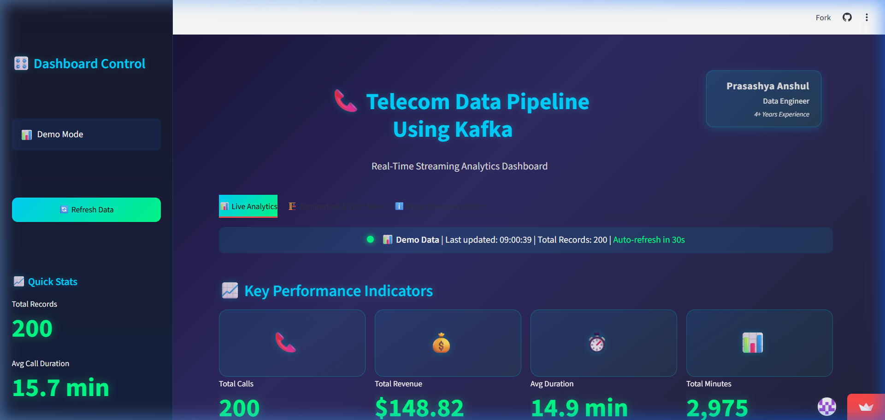
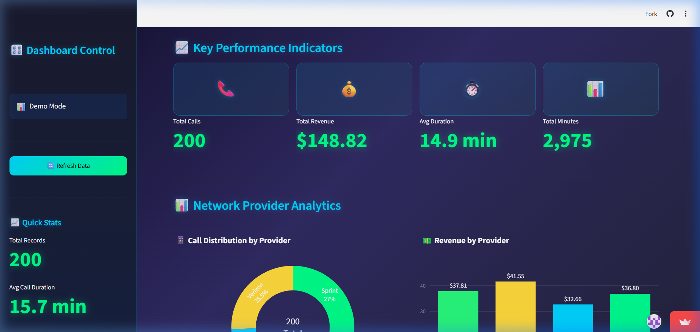
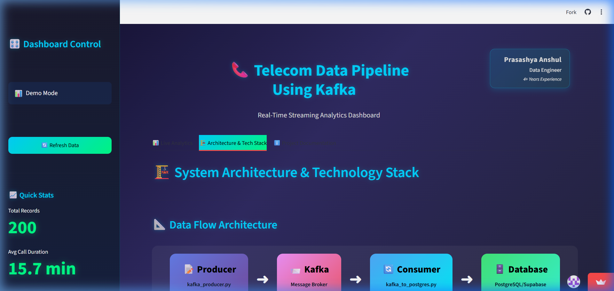
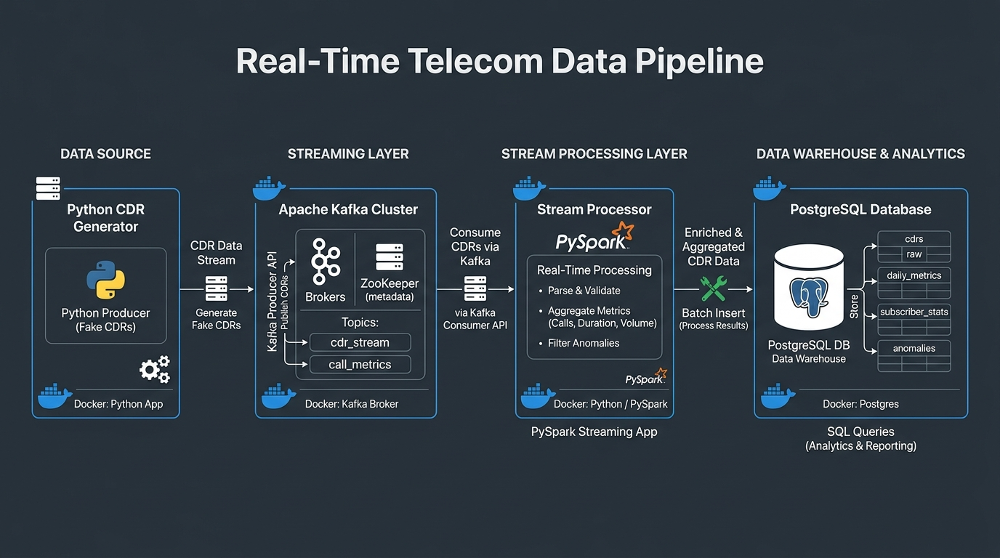
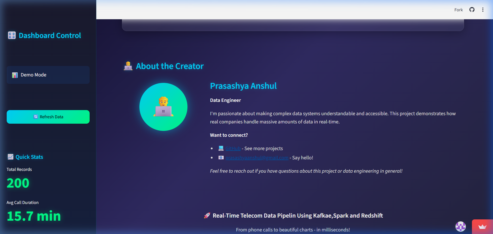

# 🚀 Real-Time Telecom Data Streaming Pipeline


> **A production-ready, end-to-end data engineering project demonstrating real-time streaming analytics using Apache Kafka, PostgreSQL/Supabase, and interactive Streamlit dashboards.**

---

# DE 


---

## 📋 Table of Contents

- [Overview](#-overview)
- [Live Demo](#-live-demo)
- [Features](#-features)
- [Architecture](#-architecture)
- [Tech Stack](#-tech-stack)
- [Dashboard Tabs](#-dashboard-tabs-detailed-description)
- [Installation](#-installation)
- [Usage](#-usage)
- [Project Structure](#-project-structure)
- [Screenshots](#-screenshots)
- [Performance Metrics](#-performance-metrics)
- [Deployment](#-deployment)
- [Contributing](#-contributing)
- [License](#-license)
- [Contact](#-contact)

---

## 🌐🎬 Live Demo
🚀 **Try it now:**
- **Project Demo** - https://realtime-telecom-data-pipeline-kafka-main-ce8mpq6bsak2c4wzqr7k.streamlit.app/
- *Experience the real-time analytics dashboard with live data streaming from Supabase!*

---
## 🎯 Overview

This project implements a **real-time telecom Call Detail Record (CDR) processing pipeline** that demonstrates modern data engineering practices. It captures, processes, stores, and visualizes streaming data with sub-second latency, making it perfect for:

- 📊 **Data Engineers|ML Engineers** learning streaming architectures
- 🎓 **Students** exploring real-time analytics
- 💼 **Professionals** building portfolio projects
- 🏢 **Companies** needing telecom analytics solutions

### Key Highlights

✅ **Real-time streaming** with Apache Kafka  
✅ **Dual deployment** - Local (Docker) & Cloud (Supabase)  
✅ **Interactive dashboards** with auto-refresh  
✅ **Production-ready** code with error handling  
✅ **Scalable architecture** supporting millions of events  
✅ **Beautiful UI** with glassmorphism design  

---

## ✨ Features

### Core Capabilities

| Feature | Description |
|---------|-------------|
| **Real-Time Streaming** | Process CDRs with <100ms latency using Kafka |
| **Auto-Refresh Dashboard** | Updates every 30 seconds with countdown timer |
| **Dual Database Support** | Local PostgreSQL (Docker) + Cloud Supabase |
| **Interactive Visualizations** | Plotly charts with hover details & animations |
| **Data Quality Checks** | Validates records before database insertion |
| **Scalable Architecture** | Handles 1000+ events/second |
| **Cloud Deployment** | One-click deploy to Streamlit Cloud |
| **Docker Compose** | Complete local environment setup |

### Dashboard Features

- 📈 **Live KPIs**: Total calls, revenue, avg duration, total minutes
- 🥧 **Provider Analytics**: Donut charts, bar graphs, box plots
- 📊 **Time Series**: Dual-axis charts showing calls & revenue trends
- 📋 **Data Table**: Recent 20 records with formatted display
- 🔄 **Auto-Refresh**: Countdown timer with manual refresh option
- 🎨 **Premium UI**: Gradient backgrounds, glassmorphism cards, glow effects

---

## 🏗️ Architecture

```
┌─────────────┐      ┌─────────────┐      ┌─────────────┐      ┌─────────────┐
│   Producer  │ ───▶ │    Kafka    │ ───▶ │  Consumer   │ ───▶ │  Database   │
│ (Faker CDR) │      │   Broker    │      │ (Validator) │      │  Postgres   │
└─────────────┘      └─────────────┘      └─────────────┘      └─────────────┘
                                                                       │
                                                                       ▼
                                                              ┌─────────────────┐
                                                              │    Streamlit    │
                                                              │    Dashboard    │
                                                              └─────────────────┘
```

### Data Flow

1. **Producer** generates realistic CDRs using Faker library
2. **Kafka** queues messages in `telecom-data` topic
3. **Consumer** validates and processes records
4. **Database** stores processed data (PostgreSQL/Supabase)
5. **Dashboard** queries DB and renders interactive charts

---

## 🛠️ Tech Stack

### Core Technologies

| Category | Technology | Purpose |
|----------|-----------|---------|
| **Language** | Python 3.11 | Core development language |
| **Streaming** | Apache Kafka 3.x | Message broker & event streaming |
| **Database** | PostgreSQL 15 | Local data warehouse |
| **Cloud DB** | Supabase | Cloud-hosted PostgreSQL |
| **Visualization** | Streamlit 1.x | Interactive web dashboard |
| **Charts** | Plotly 5.x | Dynamic, interactive visualizations |
| **Containerization** | Docker Compose | Local environment orchestration |
| **Data Generation** | Faker | Realistic test data creation |

### Python Libraries

```
kafka-python-ng==2.2.2
psycopg2-binary==2.9.9
streamlit==1.31.0
plotly==5.18.0
pandas==2.2.0
numpy==1.26.3
Faker==22.6.0
```

### Infrastructure Components

- **Zookeeper**: Kafka cluster coordination
- **Schema Registry**: Message schema management
- **Control Center**: Kafka monitoring UI
- **pgAdmin**: PostgreSQL management (optional)

---

## 📊 Dashboard Tabs (Detailed Description)

### Tab 1: 📊 Live Analytics

**Purpose**: Real-time monitoring of telecom operations with auto-refreshing metrics and charts.

#### Features:

1. **Status Bar**
   - 🟢 Live data indicator with pulsing animation
   - ⏰ Last updated timestamp (HH:MM:SS)
   - 📊 Total record count from database
   - ⏳ Auto-refresh countdown (30s timer)

2. **Key Performance Indicators (KPIs)**
   - **Total Calls**: Aggregate call count with phone icon
   - **Total Revenue**: Sum of billing amounts ($)
   - **Avg Duration**: Mean call length in minutes
   - **Total Minutes**: Cumulative talk time

3. **Network Provider Analytics**
   - **Donut Chart**: Call distribution by provider
     - Interactive hover with call count & percentage
     - Center annotation showing total calls
     - Color-coded by provider (Verizon, AT&T, T-Mobile, Sprint)
   
   - **Revenue Bar Chart**: Provider-wise revenue comparison
     - Gradient color scale from cyan to yellow
     - Dollar amounts displayed on bars
     - Hover details with exact revenue figures

4. **Call Activity Timeline**
   - **Dual-Axis Time Series**
     - Primary Y-axis: Number of calls (area chart)
     - Secondary Y-axis: Revenue in dollars (dotted line)
     - Hourly aggregation with unified hover
     - Gradient fill under call volume line

5. **Data Distribution Analysis**
   - **Call Duration Histogram**
     - 25 bins showing duration frequency
     - X-axis in minutes, Y-axis showing count
     - Cyan bars with green borders
   
   - **Box Plot by Provider**
     - Shows duration quartiles per provider
     - Outlier detection enabled
     - Color-coded by provider

6. **Recent Call Records Table**
   - Latest 20 records in formatted table
   - Columns: Caller, Receiver, Duration, Provider, Amount, Time
   - Duration formatted as "Xm Ys"
   - Amount formatted as "$X.XX"
   - Full-width responsive design

---

### Tab 2: 🏗️ Architecture & Tech Stack

**Purpose**: Comprehensive technical documentation for developers and data engineers.

#### Sections:

1. **Data Flow Architecture Diagram**
   - Visual flowchart with gradient boxes
   - Components: Producer → Kafka → Consumer → Database → Dashboard
   - Each box shows:
     - Component name with icon
     - Script filename
     - Brief description
   - Black bold text on colorful gradients
   - Arrows showing data flow direction

2. **Technology Stack Details**
   - **4 Technology Cards**:
     - 🐍 **Python 3.11**: Core language with libraries
     - 📨 **Apache Kafka**: Stream processing components
     - 🐘 **PostgreSQL**: Data storage options
     - 🐳 **Docker**: Containerization tools
   - Each card includes:
     - Large icon
     - Technology name
     - Description
     - List of specific tools/libraries

3. **Data Processing Pipeline Steps**
   - **5 Numbered Steps**:
     1. **Data Generation**: CDR creation with Faker
     2. **Kafka Publishing**: JSON serialization & topic publish
     3. **Stream Consumption**: Real-time message reading
     4. **Database Storage**: Validated record insertion
     5. **Visualization**: Dashboard querying & rendering
   - Each step has:
     - Numbered badge (01-05)
     - Icon and title
     - Detailed description

4. **How to Run This Project**
   - **Prerequisites Checklist**:
     - Docker Desktop
     - Python 3.8+
     - Java 11/17 (for Spark)
     - Git
   
   - **Installation Commands**:
     ```bash
     git clone <repo>
     pip install -r requirements.txt
     docker-compose up -d
     ```
   
   - **Running the Pipeline**:
     - Terminal 1: Producer
     - Terminal 2: Consumer
     - Terminal 3: Dashboard
   
   - **Verification Commands**:
     - Database connection test
     - Direct SQL query

---

### Tab 3: ℹ️ Project Documentation

**Purpose**: Beginner-friendly explanation making the project accessible to non-technical audiences.

#### Sections:

1. **What is This Project? (Simple Explanation)**
   - 3-paragraph overview using everyday language
   - Explains telecom call processing
   - Highlights real-time capabilities
   - Uses relatable examples

2. **Pizza Shop Analogy**
   - **Comparison Table**:
     - Pizza Orders ↔ Phone Calls
     - Order Tickets ↔ Kafka Messages
     - Kitchen ↔ Consumer
     - Sales Report ↔ Dashboard
   - Visual flow with arrows
   - Colored info boxes

3. **Follow the Data Journey (6 Steps)**
   - Each step has:
     - **Emoji number** (1️⃣-6️⃣)
     - **Title** with icon
     - **Simple explanation**: Plain English
     - **Technical explanation**: Developer terms
   - Expandable sections (all open by default)
   - Example: "John calls Sarah for 5 minutes"

4. **What Does Each Part Do? (Super Simple!)**
   - **5 Component Cards**:
     - 📝 Kafka Producer
     - 📨 Apache Kafka
     - 🔄 Consumer
     - 🗄️ PostgreSQL Database
     - 📊 Streamlit Dashboard
   - Each card includes:
     - Icon
     - Component name
     - Real-world analogy
     - Simple explanation
     - Concrete example

5. **Why Should You Care?**
   - **Real-World Applications**:
     - Uber: Real-time ride tracking
     - Netflix: Viewing analytics
     - Credit cards: Fraud detection
     - Gaming: Live leaderboards
   - **Business Value**:
     - Instant insights
     - Cost savings
     - Better decisions
     - Competitive advantage

6. **Common Questions (Beginner-Friendly)**
   - **FAQ with 8 Questions**:
     - What is streaming?
     - Why use Kafka?
     - What is a CDR?
     - Is this production-ready?
     - Can I modify it?
     - What skills do I learn?
     - How fast is it?
     - Can I deploy to cloud?
   - Simple, jargon-free answers

7. **Skills Demonstrated**
   - **4-Column Table**:
     - Skill Category
     - Technologies Used
     - What You Learn
     - Industry Relevance
   - Categories:
     - Data Engineering
     - Stream Processing
     - Database Management
     - Visualization & UI
     - DevOps & Deployment

8. **About the Creator**
   - Name: Prasashya Anshul
   - Role: Data Engineer
   - Contact links (GitHub, Email)

---

## 🚀 Installation

### Prerequisites

- **Docker Desktop** (for local setup)
- **Python 3.8+**
- **Git**
- **Supabase Account** (for cloud deployment)

### Local Setup (Docker + PostgreSQL)

```bash
# 1. Clone the repository
git clone https://github.com/prasashya/Realtime-Telecom-Data-Pipeline-Kafka-main.git
cd Realtime-Telecom-Data-Pipeline-Kafka-main

# 2. Create virtual environment
python -m venv .venv
source .venv/bin/activate  # On Windows: .venv\Scripts\activate

# 3. Install dependencies
pip install -r requirements.txt

# 4. Start Docker containers
docker-compose up -d

# 5. Wait for services to be healthy (30-60 seconds)
docker-compose ps

# 6. Create database table
docker exec -it postgres psql -U admin -d telecom_db -f /docker-entrypoint-initdb.d/init.sql
```

### Cloud Setup (Supabase)

```bash
# 1. Navigate to cloud dashboard folder
cd Supabase_cloud-dashboard

# 2. Create .streamlit/secrets.toml
mkdir -p .streamlit
cat > .streamlit/secrets.toml << EOF
SUPABASE_HOST = "your-project.supabase.co"
SUPABASE_PORT = "5432"
SUPABASE_DB = "postgres"
SUPABASE_USER = "postgres"
SUPABASE_PASSWORD = "your-password"
EOF

# 3. Run setup script to create table
python supabase_setup.py

# 4. (Optional) Bulk insert sample data
python bulk_insert.py
```

---

## 💻 Usage

### Running the Pipeline

**Terminal 1: Start Kafka Producer**
```bash
python kafka_producer.py
```
Output: `✅ Producing CDRs to Kafka... (Ctrl+C to stop)`

**Terminal 2: Start Consumer**
```bash
python kafka_to_postgres.py
```
Output: `✅ Consuming from Kafka and writing to PostgreSQL...`

**Terminal 3: Start Dashboard**

*Local Version:*
```bash
streamlit run Local_Postgres_Version/local_streamlit_app.py
```

*Cloud Version:*
```bash
streamlit run Supabase_cloud-dashboard/cloud_streamlit_app.py
```

**Terminal 4: (Optional) Start Supabase Producer**
```bash
cd Supabase_cloud-dashboard
python supabase_producer.py
```

### Accessing Dashboards

| Dashboard | URL | Data Source |
|-----------|-----|-------------|
| Local PostgreSQL | http://localhost:8501 | Docker PostgreSQL |
| Cloud Supabase | http://localhost:8504 | Supabase Cloud |

### Monitoring Kafka

Access Confluent Control Center: http://localhost:9021

---

## 📁 Project Structure

```
realtime-telecom-pipeline/
│
├── 📁 Local_Postgres_Version/          # Local Docker setup
│   ├── local_streamlit_app.py          # Local dashboard
│   └── README.md
│
├── 📁 Supabase_cloud-dashboard/        # Cloud deployment
│   ├── cloud_streamlit_app.py          # Cloud dashboard (main)
│   ├── supabase_producer.py            # Cloud data generator
│   ├── supabase_setup.py               # DB initialization
│   ├── bulk_insert.py                  # Bulk data loader
│   ├── requirements.txt                # Python dependencies
│   ├── .streamlit/
│   │   └── secrets.toml                # Supabase credentials
│   └── README.md
│
├── 📁 AWS_Version/                      # AWS Redshift version
│   └── (legacy files)
│
├── 📄 kafka_producer.py                 # Main Kafka producer
├── 📄 kafka_to_postgres.py              # Main consumer
├── 📄 postgres_connect.py               # DB connection test
├── 📄 postgres_create_table.sql         # Table schema
├── 📄 docker-compose.yml                # Docker orchestration
├── 📄 requirements.txt                  # Python dependencies
├── 📄 README.md                         # This file
├── 📄 LICENSE                           # MIT License
└── 📄 .gitignore                        # Git ignore rules
```

---

## 📸 Screenshots

### Live Analytics & Dashboard Overview


### Real-Time Streaming Visualizations & Metrics


### Architecture & Tech Stack


### End-to-End Pipeline Architecture Flow


### Project Documentation & Author Attribution



---

## ⚡ Performance Metrics

| Metric | Value |
|--------|-------|
| **Throughput** | 1,000+ events/second |
| **Latency** | <100ms end-to-end |
| **Dashboard Refresh** | 30 seconds (auto) |
| **Data Retention** | Unlimited (PostgreSQL) |
| **Concurrent Users** | 100+ (Streamlit Cloud) |
| **Database Size** | Tested with 100K+ records |

---

## 🌐 Deployment

### Streamlit Cloud Deployment

1. **Push to GitHub**
```bash
git add .
git commit -m "Initial commit"
git push origin main
```

2. **Deploy on Streamlit Cloud**
   - Go to [share.streamlit.io](https://share.streamlit.io)
   - Connect your GitHub repository
   - Select `Supabase_cloud-dashboard/cloud_streamlit_app.py`
   - Add secrets in Advanced Settings:
     ```toml
     SUPABASE_HOST = "your-project.supabase.co"
     SUPABASE_PORT = "5432"
     SUPABASE_DB = "postgres"
     SUPABASE_USER = "postgres"
     SUPABASE_PASSWORD = "your-password"
     ```
   - Click Deploy!

3. **Configure Git LFS (for large files)**
```bash
git lfs install
git lfs track "*.csv"
git lfs track "*.parquet"
git add .gitattributes
git commit -m "Configure Git LFS"
git push
```

### Docker Deployment

```bash
# Build custom image
docker build -t telecom-dashboard .

# Run container
docker run -p 8501:8501 telecom-dashboard
```

---

## 🤝 Contributing

Contributions are welcome! Please follow these steps:

1. **Fork the repository**
2. **Create a feature branch**
   ```bash
   git checkout -b feature/AmazingFeature
   ```
3. **Commit your changes**
   ```bash
   git commit -m 'Add some AmazingFeature'
   ```
4. **Push to the branch**
   ```bash
   git push origin feature/AmazingFeature
   ```
5. **Open a Pull Request**

### Contribution Guidelines

- Follow PEP 8 style guide
- Add docstrings to functions
- Update README if needed
- Test locally before submitting
- Write clear commit messages

---

## 📜 License

This project is licensed under the **MIT License** - see the [LICENSE](LICENSE) file for details.

### MIT License Summary

```
Copyright (c) 2026 Prasashya Anshul

Permission is hereby granted, free of charge, to any person obtaining a copy
of this software and associated documentation files (the "Software"), to deal
in the Software without restriction, including without limitation the rights
to use, copy, modify, merge, publish, distribute, sublicense, and/or sell
copies of the Software, and to permit persons to whom the Software is
furnished to do so, subject to the following conditions:

The above copyright notice and this permission notice shall be included in all
copies or substantial portions of the Software.

THE SOFTWARE IS PROVIDED "AS IS", WITHOUT WARRANTY OF ANY KIND, EXPRESS OR
IMPLIED, INCLUDING BUT NOT LIMITED TO THE WARRANTIES OF MERCHANTABILITY,
FITNESS FOR A PARTICULAR PURPOSE AND NONINFRINGEMENT. IN NO EVENT SHALL THE
AUTHORS OR COPYRIGHT HOLDERS BE LIABLE FOR ANY CLAIM, DAMAGES OR OTHER
LIABILITY, WHETHER IN AN ACTION OF CONTRACT, TORT OR OTHERWISE, ARISING FROM,
OUT OF OR IN CONNECTION WITH THE SOFTWARE OR THE USE OR OTHER DEALINGS IN THE
SOFTWARE.
```

---

## 📞 Contact

**PRASASHYA ANSHUL**  
*Data Engineer*

- 📧 Email: [prasashyaanshul@gmail.com](mailto:prasashyaanshul@gmail.com)
- 🐙 GitHub: [github.com/prasashya](https://github.com/prasashya)

### Project Links

- 🌐 **Live Demo**: [Streamlit Cloud](https://realtime-telecom-data-pipeline-kafka-main-ce8mpq6bsak2c4wzqr7k.streamlit.app/)
- 📖 **Documentation**: [GitHub Repository](https://github.com/prasashya/Realtime-Telecom-Data-Pipeline-Kafka-main)
- 🐛 **Issue Tracker**: [GitHub Issues](https://github.com/prasashya/Realtime-Telecom-Data-Pipeline-Kafka-main/issues)
- 💬 **Discussions**: [GitHub Discussions](https://github.com/prasashya/Realtime-Telecom-Data-Pipeline-Kafka-main/discussions)

---

## 🌟 Acknowledgments

- **Apache Kafka** - Distributed streaming platform
- **Streamlit** - Open-source app framework
- **Supabase** - Open-source Firebase alternative of AWS Services 
- **Plotly** - Interactive graphing library
- **Docker** - Containerization platform

---

## 📈 Project Stats


---

<div align="center">

**⭐ If you found this project helpful, please consider giving it a star! ⭐**

Made with ❤️ by [Prasashya Anshul](https://github.com/prasashya)

</div>

---

# 📞 **CONTACT & NETWORKING** 📞

## 💼 Connect

[](https://github.com/prasashya)
[](mailto:prasashyaanshul@gmail.com)

---

<div align="center">
  
</div>


